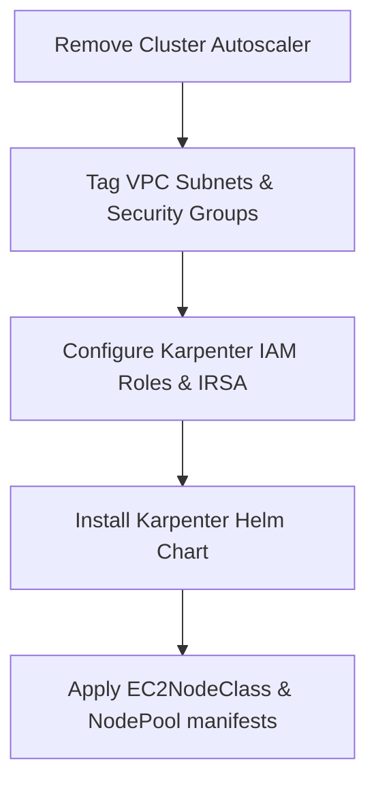

# 🚀 Three-Tier Application on Amazon EKS

A production-grade, three-tier web application deployed on **Amazon EKS (Elastic Kubernetes Service)** using **Terraform** for infrastructure provisioning, **Helm** for managed add-ons, and raw **Kubernetes manifests** for application workloads. The stack includes a React frontend, a Node.js/Go backend API, a MongoDB database, and a full observability suite powered by Prometheus and Grafana.

---

## 📁 Repository Structure

```
.
├── app/
│   ├── frontend/          # React frontend source code
│   └── backend/           # Backend API source code
├── k8s_manifests/
│   ├── mongo/             # MongoDB deployment, service & secrets
│   │   ├── deploy.yaml
│   │   ├── service.yaml
│   │   └── secrets.yaml
│   ├── backend-deployment.yaml
│   ├── backend-service.yaml
│   ├── frontend-deployment.yaml
│   ├── frontend-service.yaml
│   ├── full_stack_lb.yaml     # Main ALB Ingress (app traffic routing)
│   ├── monitoring-lb.yaml     # ALB Ingress for Grafana/Prometheus
│   ├── hpa.yaml               # Horizontal Pod Autoscaler for backend
│   ├── stateful.yaml          # Example StatefulSet manifest
│   ├── daemonset.yaml         # Example DaemonSet manifest
│   ├── cron.yaml              # Example CronJob manifest
│   └── job.yaml               # Example Job manifest
├── terraform/
│   ├── vpc.tf                 # VPC, subnets, NAT gateway
│   ├── eks.tf                 # EKS cluster and managed node groups
│   ├── iam.tf                 # IAM roles and policies
│   ├── autoscaler-iam.tf      # Cluster Autoscaler IRSA role
│   ├── autoscaler-manifest.tf # Cluster Autoscaler Kubernetes resources
│   ├── helm-load-balancer-controller.tf  # AWS LBC via Helm
│   ├── ebs_csi_driver.tf      # EBS CSI driver addon
│   ├── monitoring.tf          # Prometheus & Grafana stack
│   ├── backend.tf             # Remote state (S3)
│   ├── provider.tf            # Provider versions
│   └── variables.tf           # Input variables
├── kustomize/
│   ├── myapp/                 # Kustomize overlay for custom app
│   └── nginx/                 # Kustomize base + overlays for nginx
└── load_test/
    ├── locustfile.py          # Locust load test definition
    └── alb-ingress.yaml       # Ingress for Locust dashboard
```

---

## 🏗️ Architecture Overview

### Complete Application Architecture & Networking

The application follows a **classic three-tier architecture** (Presentation → Logic → Data) deployed inside an AWS EKS cluster, with all infrastructure defined as code using Terraform.

```
                          ┌─────────────────────────────────────────────────────────────┐
                          │                      AWS Cloud (us-west-2)                   │
                          │                                                               │
  User / Browser ─────► ALB (Internet-Facing)                                            │
                          │         │                                                     │
                          │    ┌────▼─────────────────────────────┐                      │
                          │    │     Ingress (AWS ALB Controller)  │                      │
                          │    │      Host: app.arnaba075.com      │                      │
                          │    │                                   │                      │
                          │    │  /api  ──────► backend-svc:8080  │                      │
                          │    │  /    ──────► frontend-svc:3000  │                      │
                          │    └───────────────────────────────────┘                     │
                          │                                                               │
                          │  ┌──────────────────────────────────────────────────────┐    │
                          │  │              VPC  (CIDR: 10.0.0.0/16)                │    │
                          │  │                                                      │    │
                          │  │  ┌───────────────────────────────────────────────┐  │    │
                          │  │  │   Public Subnets (us-west-2a / 2b)            │  │    │
                          │  │  │   10.0.64.0/19  |  10.0.96.0/19              │  │    │
                          │  │  │                                               │  │    │
                          │  │  │   • AWS Application Load Balancer (ALB)      │  │    │
                          │  │  │   • NAT Gateway (single, shared)             │  │    │
                          │  │  └───────────────────────────────────────────────┘  │    │
                          │  │                          │                           │    │
                          │  │              (Private Routing via NAT)              │    │
                          │  │                          │                           │    │
                          │  │  ┌───────────────────────▼───────────────────────┐  │    │
                          │  │  │   Private Subnets (us-west-2a / 2b)           │  │    │
                          │  │  │   10.0.0.0/19   |  10.0.32.0/19              │  │    │
                          │  │  │                                               │  │    │
                          │  │  │  ┌───────────────────────────────────────┐   │  │    │
                          │  │  │  │       EKS Cluster: my-eks-cluster     │   │  │    │
                          │  │  │  │       (Kubernetes v1.31)              │   │  │    │
                          │  │  │  │                                       │   │  │    │
                          │  │  │  │  Namespace: workshop                  │   │  │    │
                          │  │  │  │  ┌──────────┐  ┌────────┐  ┌──────┐  │   │  │    │
                          │  │  │  │  │ Frontend │  │Backend │  │Mongo │  │   │  │    │
                          │  │  │  │  │  Pod(s)  │─►│API Pod │─►│ Pod  │  │   │  │    │
                          │  │  │  │  │ :3000    │  │ :8080  │  │:27017│  │   │  │    │
                          │  │  │  │  └──────────┘  └────────┘  └──────┘  │   │  │    │
                          │  │  │  │                                       │   │  │    │
                          │  │  │  │  Namespace: prometheus                │   │  │    │
                          │  │  │  │  ┌─────────────────────────────────┐  │   │  │    │
                          │  │  │  │  │ Prometheus + Grafana (Helm)     │  │   │  │    │
                          │  │  │  │  └─────────────────────────────────┘  │   │  │    │
                          │  │  │  │                                       │   │  │    │
                          │  │  │  │  Namespace: kube-system               │   │  │    │
                          │  │  │  │  • AWS Load Balancer Controller       │   │  │    │
                          │  │  │  │  • Cluster Autoscaler                 │   │  │    │
                          │  │  │  │  • CoreDNS / kube-proxy / VPC CNI    │   │  │    │
                          │  │  │  └───────────────────────────────────────┘   │  │    │
                          │  │  │                                               │  │    │
                          │  │  │  Node Groups:                                 │  │    │
                          │  │  │  • general  (t3.small,  ON_DEMAND, 1-10)     │  │    │
                          │  │  │  • spot     (t3.micro,  SPOT,      1-10)     │  │    │
                          │  │  └───────────────────────────────────────────────┘  │    │
                          │  └──────────────────────────────────────────────────────┘   │
                          └─────────────────────────────────────────────────────────────┘
```

---

### Layer-by-Layer Breakdown

#### 1. 🌐 Networking Layer (VPC)

| Resource | Details |
|---|---|
| VPC CIDR | `10.0.0.0/16` |
| Public Subnets | `10.0.64.0/19` (2a), `10.0.96.0/19` (2b) |
| Private Subnets | `10.0.0.0/19` (2a), `10.0.32.0/19` (2b) |
| NAT Gateway | Single shared NAT (cost-optimised for dev) |
| DNS Support | Enabled (`enableDnsHostnames`, `enableDnsSupport`) |
| EKS Control Plane | Both public and private endpoint access enabled |

Public subnets are tagged with `kubernetes.io/role/elb = 1` so the AWS Load Balancer Controller can automatically discover them when provisioning internet-facing ALBs. Private subnets are tagged with `kubernetes.io/role/internal-elb = 1` for internal load balancers.

EKS worker nodes are placed **exclusively in private subnets**. They access the internet (to pull container images, communicate with AWS APIs, etc.) via the NAT Gateway situated in the public subnet.

#### 2. ☸️ EKS Cluster Layer

The cluster is managed via the [terraform-aws-modules/eks](https://registry.terraform.io/modules/terraform-aws-modules/eks/aws/latest) module (v20.x):

- **Cluster version**: Kubernetes `1.31`
- **IRSA** (IAM Roles for Service Accounts) is enabled, providing fine-grained, pod-level IAM permissions without storing long-lived credentials.
- **EKS Access Entries**: Admin access is granted via an IAM role (`eks-admin`) using EKS Access Entries (the new preferred mechanism over `aws-auth` ConfigMap).

**Node Groups:**

| Group | Instance | Capacity Type | Min | Max | Purpose |
|---|---|---|---|---|---|
| `general` | `t3.small` | ON_DEMAND | 1 | 10 | Core workloads, stable baseline |
| `spot` | `t3.micro` | SPOT | 1 | 10 | Cost-efficient, fault-tolerant batch work (tainted `market=spot:NoSchedule`) |

The Spot node group has a taint (`market=spot:NoSchedule`) so only workloads that explicitly **tolerate** the taint are scheduled there, preventing accidental placement of critical services.

**EKS Managed Add-ons** (versioned and managed by AWS):

| Add-on | Version |
|---|---|
| `kube-proxy` | v1.31.0-eksbuild.2 |
| `vpc-cni` | v1.18.3-eksbuild.1 |
| `coredns` | v1.11.3-eksbuild.1 |
| `aws-ebs-csi-driver` | v1.34.0-eksbuild.1 |

#### 3. 🔁 Traffic Routing (AWS Load Balancer Controller + ALB Ingress)

The **AWS Load Balancer Controller** (v1.9.x) is deployed via Helm into `kube-system`. It watches Kubernetes `Ingress` resources and automatically provisions and configures **AWS Application Load Balancers (ALBs)**.

**Main Application Ingress** (`full_stack_lb.yaml`):
- Uses `alb.ingress.kubernetes.io/group.name: demo-lb` to consolidate multiple Ingress objects onto a **single shared ALB**, reducing cost.
- The ALB is **internet-facing** (`scheme: internet-facing`) with **IP target mode** (`target-type: ip`), meaning traffic is routed directly to pod IPs — bypassing an extra hop through NodePort.
- Path-based routing rules on host `app.arnaba075.com`:
  - `/api/**` → `api` (backend) Service on port `8080`
  - `/**` (catch-all) → `frontend` Service on port `3000`

```
Internet → ALB → /api  → backend ClusterIP Service → Backend Pod(s)
                → /    → frontend ClusterIP Service → Frontend Pod(s)
```

Because the frontend uses a **relative path** (`/api/tasks`) as `REACT_APP_BACKEND_URL`, both the React app and the API live under the same ALB hostname. This eliminates CORS issues entirely — the browser always talks to the same origin.

**Monitoring Ingress** (`monitoring-lb.yaml`):
- Also joins the same `demo-lb` ALB group.
- Routes traffic from `monitor.sandipdas.in` → `prometheus-grafana` service.
- **HTTPS enforced** via ACM certificate and `ssl-redirect: 443` annotation.

**Backend and Frontend Services** both use `type: ClusterIP` — they are never directly exposed outside the cluster. All external traffic flows through the ALB Ingress.

#### 4. ⚖️ Auto-scaling

**Horizontal Pod Autoscaler (HPA)** — `hpa.yaml`
- Targets the `api` Deployment in the `workshop` namespace.
- Scales between **2–10 replicas** when CPU utilisation exceeds **50%**.

**Cluster Autoscaler** — `autoscaler-manifest.tf`
- Deployed as a Kubernetes `Deployment` in `kube-system`.
- Uses IRSA via the `cluster-autoscaler` IAM role for permission to call AWS Auto Scaling Group APIs.
- Configured with `--expander=least-waste` to optimise node selection.
- Auto-discovers node groups via ASG tags: `k8s.io/cluster-autoscaler/enabled` and `k8s.io/cluster-autoscaler/<cluster-name>`.
- Runs with `system-cluster-critical` priority class so it is never evicted.

When the HPA scales up pods and existing nodes cannot accommodate them, the Cluster Autoscaler increases the EC2 node count. When load drops, it safely drains and terminates excess nodes.

#### 5. 📊 Observability (Prometheus + Grafana)

Deployed via the `kube-prometheus-stack` Helm chart (v66.x) into the `prometheus` namespace:
- **Prometheus** scrapes metrics from all nodes and pods automatically.
- **Grafana** provides dashboards for cluster-wide metrics.
- Exposed externally via its own Ingress on the same shared ALB group, protected by HTTPS/TLS.

---

## 🗄️ MongoDB Setup & Data Persistence

### How MongoDB Is Deployed

MongoDB (`mongo:4.4.6`) is deployed as a standard Kubernetes `Deployment` (not a StatefulSet) in the `workshop` namespace.

```yaml
# k8s_manifests/mongo/deploy.yaml
containers:
  - name: mongodb
    image: mongo:4.4.6
    command:
      - "numactl"
      - "--interleave=all"
      - "mongod"
      - "--wiredTigerCacheSizeGB"
      - "0.1"   # limits WiredTiger RAM usage for small nodes
      - "--bind_ip"
      - "0.0.0.0"
```

**Key tuning decisions:**
- `numactl --interleave=all` is used to distribute memory allocation evenly across NUMA nodes, which avoids performance degradation on multi-NUMA systems (common on AWS instances). This is a known recommendation for MongoDB in containerised environments.
- `--wiredTigerCacheSizeGB 0.1` caps the WiredTiger internal cache at 100 MB. Without this flag, WiredTiger defaults to `(RAM - 1GB) / 2`, which on a small `t3.small` node (2 GB RAM) would overwhelm the container. This flag ensures MongoDB stays within its resource limits.
- Resource requests (`256m CPU`, `512Mi RAM`) and limits (`500m CPU`, `1Gi RAM`) prevent MongoDB from starving other pods on the same node.

### Credentials Management via Kubernetes Secrets

MongoDB credentials are stored as a Kubernetes `Secret` (`mongo-sec`) in base64-encoded form:

```yaml
# k8s_manifests/mongo/secrets.yaml
data:
  username: YWRtaW4=    # admin
  password: cGFzc3dvcmQxMjM=  # password123
```

Both the MongoDB pod and the backend API pod reference the **same Secret** via `secretKeyRef`, ensuring credentials are never hardcoded in any deployment manifest or container image. The backend connects using:

```
mongodb://mongodb-svc:27017/todo?directConnection=true
```

The `directConnection=true` flag is important — it bypasses MongoDB's replica set topology discovery, ensuring the client connects directly to the single standalone instance without attempting replication handshake.

### Service Discovery

A headless-style **ClusterIP Service** (`mongodb-svc`) exposes MongoDB on port `27017` within the cluster. The backend resolves this via Kubernetes CoreDNS as `mongodb-svc.workshop.svc.cluster.local`, stable across pod restarts.

### Persistence Strategy (and Trade-offs)

The volume mount block in the MongoDB deployment is **intentionally commented out**:

```yaml
# volumeMounts:
#   - name: mongo-volume
#     mountPath: /data/db
# volumes:
# - name: mongo-volume
#   persistentVolumeClaim:
#     claimName: mongo-volume-claim
```

**Why it was commented out for this interview/demo deployment:**

In a demo or interview architecture context, persistent volumes add setup complexity (StorageClass, PVC provisioning via the EBS CSI driver) and cost overhead. For the purpose of demonstrating the architectural patterns (networking, autoscaling, ingress routing, IRSA), in-memory data is sufficient.

**However, the `aws-ebs-csi-driver` addon is already installed on the cluster**, which means the full persistence path is available and production-ready. To enable it:

1. Create a `PersistentVolumeClaim` (PVC) referencing the `gp2` or `gp3` StorageClass:

```yaml
apiVersion: v1
kind: PersistentVolumeClaim
metadata:
  name: mongo-volume-claim
  namespace: workshop
spec:
  accessModes:
    - ReadWriteOnce
  storageClassName: gp2
  resources:
    requests:
      storage: 10Gi
```

2. Uncomment the `volumeMounts` and `volumes` sections in `k8s_manifests/mongo/deploy.yaml`.

The EBS CSI driver will then dynamically provision an AWS EBS volume, attach it to the node running the MongoDB pod, and mount it at `/data/db`. Data will survive pod restarts as long as the PVC exists.

**For true production stateful deployments**, the recommended approach is converting MongoDB to a **StatefulSet** (see `k8s_manifests/stateful.yaml` for the pattern). StatefulSets provide:
- **Stable, predictable pod names** (`mongodb-0`, `mongodb-1`, ...)
- **Stable network identities** via headless Services
- **Per-replica PVCs** via `volumeClaimTemplates`
- **Ordered, graceful rolling updates**

---

## 🛠️ How to Use This Repository

### Prerequisites

Ensure the following tools are installed and configured:

| Tool | Version | Purpose |
|---|---|---|
| `terraform` | `>= 1.9` | Infrastructure provisioning |
| `aws` CLI | Latest | AWS authentication & EKS token |
| `kubectl` | Compatible with k8s 1.31 | Kubernetes resource management |
| `helm` | `>= 3.x` | Installing Helm charts |
| `kustomize` | Latest | Kustomize overlay management |

### Step 1: Configure AWS Credentials

```bash
aws configure
# or
export AWS_ACCESS_KEY_ID="your-access-key"
export AWS_SECRET_ACCESS_KEY="your-secret-key"
export AWS_DEFAULT_REGION="us-west-2"
```

Ensure your IAM user has sufficient permissions: EKS, EC2, VPC, IAM, S3, and ELB.

### Step 2: Set Up the S3 Backend for Terraform State

Before initialising Terraform, create the S3 bucket for remote state:

```bash
aws s3api create-bucket \
  --bucket three-tier-interview \
  --region us-west-2 \
  --create-bucket-configuration LocationConstraint=us-west-2
```

### Step 3: Provision Infrastructure with Terraform

```bash
cd terraform/

# Initialise providers and backend
terraform init

# Review the execution plan
terraform plan

# Apply the configuration (~15–20 minutes for full EKS cluster)
terraform apply -auto-approve
```

This single `terraform apply` will:
1. Create the VPC, subnets, NAT Gateway, and route tables.
2. Provision the EKS cluster with both node groups.
3. Install the AWS Load Balancer Controller via Helm.
4. Deploy the Cluster Autoscaler (IRSA + Kubernetes manifests).
5. Install the `kube-prometheus-stack` (Prometheus + Grafana) via Helm in the `prometheus` namespace.

### Step 4: Configure `kubectl`

```bash
aws eks update-kubeconfig \
  --region us-west-2 \
  --name my-eks-cluster
```

Verify connectivity:

```bash
kubectl get nodes
kubectl get pods -A
```

### Step 5: Deploy the Application

Create the `workshop` namespace and apply all application manifests:

```bash
kubectl create namespace workshop

# MongoDB (deploy secrets first, then the pod and service)
kubectl apply -f k8s_manifests/mongo/secrets.yaml
kubectl apply -f k8s_manifests/mongo/deploy.yaml
kubectl apply -f k8s_manifests/mongo/service.yaml

# Wait for MongoDB to be ready
kubectl rollout status deployment/mongodb -n workshop

# Backend API
kubectl apply -f k8s_manifests/backend-deployment.yaml
kubectl apply -f k8s_manifests/backend-service.yaml

# Frontend
kubectl apply -f k8s_manifests/frontend-deployment.yaml
kubectl apply -f k8s_manifests/frontend-service.yaml

# Ingress (ALB) - this triggers ALB provisioning on AWS
kubectl apply -f k8s_manifests/full_stack_lb.yaml

# HPA for backend
kubectl apply -f k8s_manifests/hpa.yaml
```

### Step 6: Get the ALB DNS Name

```bash
kubectl get ingress -n workshop
```

Copy the `ADDRESS` field (the ALB DNS name). Point your domain `app.arnaba075.com` to this DNS via a CNAME record in Route 53 (or your DNS provider).

### Step 7: Deploy Monitoring Ingress (Optional)

```bash
kubectl apply -f k8s_manifests/monitoring-lb.yaml
```

> **Note**: Update the `certificate-arn` in `monitoring-lb.yaml` with your own ACM certificate ARN before applying.

### Step 8: Run Load Tests (Optional)

```bash
# Deploy Locust in-cluster
kubectl apply -f load_test/alb-ingress.yaml

# Or run Locust locally against the ALB
pip install locust
locust -f load_test/locustfile.py --host=http://<ALB-DNS>
```

Access the Locust UI at `http://localhost:8089` to configure user count and spawn rate.

### Step 9: Tear Down

```bash
# Remove Kubernetes resources first
kubectl delete namespace workshop

# Destroy all Terraform-managed infrastructure
cd terraform/
terraform destroy -auto-approve
```

> ⚠️ Always delete Kubernetes `Ingress` resources before `terraform destroy` — otherwise the ALB and its associated security groups may not be cleaned up properly, causing Terraform to fail on VPC deletion.

---

## ⚙️ Using Kustomize

The `kustomize/` directory contains examples of environment-based configuration management:

- `kustomize/nginx/base/` — Base nginx deployment
- `kustomize/nginx/overlays/` — Environment-specific patches (dev, staging, prod)
- `kustomize/myapp/` — Custom app kustomization

Apply a specific overlay:

```bash
kubectl apply -k kustomize/nginx/overlays/dev/
```

---

## 🔒 IAM & IRSA (Security Model)

| Component | IAM Role | Bound To |
|---|---|---|
| AWS Load Balancer Controller | `aws-load-balancer-controller` | `kube-system/aws-load-balancer-controller` SA |
| Cluster Autoscaler | `cluster-autoscaler` | `kube-system/cluster-autoscaler` SA |
| EKS Admin Access | `eks-admin` | IAM group `eks-admin` (user `user1`) |

IRSA (IAM Roles for Service Accounts) uses the cluster's OIDC provider to link a Kubernetes ServiceAccount to an AWS IAM role. This avoids embedding IAM credentials in pods or using EC2 instance profile permissions that apply to all pods on a node.

---

## 🧗 Challenges Faced During Implementation

### 1. 🔐 EKS Cluster Access After Provisioning

**Problem:** After creating the EKS cluster with Terraform, `kubectl` commands were failing with `Unauthorized` or `cannot list pods` errors for non-creator IAM entities.

**Root Cause:** The historical `aws-auth` ConfigMap approach only grants the cluster creator access by default. Adding other users required manually patching the ConfigMap.

**Solution:** Migrated to **EKS Access Entries** (the recommended approach from EKS v1.29+). The `eks-admin` IAM role was associated with the `AmazonEKSClusterAdminPolicy` access policy directly in the Terraform EKS module, eliminating the need to manage the `aws-auth` ConfigMap manually.

```hcl
access_entries = {
  admin = {
    principal_arn = module.eks_admins_iam_role.iam_role_arn
    policy_associations = {
      admin = {
        policy_arn   = "arn:aws:eks::aws:cluster-access-policy/AmazonEKSClusterAdminPolicy"
        access_scope = { type = "cluster" }
      }
    }
  }
}
```

---

### 2. 🔄 Terraform Provider Timing / Race Conditions with EKS

**Problem:** Helm and Kubernetes resources (like the `prometheus` namespace and Helm releases) were being applied before the EKS cluster API server was fully ready, causing sporadic failures during `terraform apply`.

**Solution:** Introduced a `time_sleep` resource that adds a 20-second delay after the EKS module completes before the Kubernetes namespace and Helm release resources are created:

```hcl
resource "time_sleep" "wait_for_kubernetes" {
  depends_on      = [module.eks]
  create_duration = "20s"
}
```

---

### 3. 🌐 CORS Issues with Frontend ↔ Backend Communication

**Problem:** Initially, `REACT_APP_BACKEND_URL` was set to the full backend ALB URL (e.g., `http://api.example.com/api/tasks`). This caused browser-level CORS blocks because the frontend and backend were on different origins.

**Solution:** Configured the frontend to use a **relative URL** (`/api/tasks`) and set up **path-based routing** on the same ALB Ingress. Since both `/` and `/api` routes are served from the same hostname, the browser sees a same-origin request and no CORS preflight is triggered.

```yaml
# frontend-deployment.yaml
env:
  - name: REACT_APP_BACKEND_URL
    value: "/api/tasks"  # Relative path — same ALB hostname
```

---

### 4. 🛢️ MongoDB OOM Kills on Small Nodes

**Problem:** The MongoDB pod was being OOM-killed (Out of Memory) on `t3.small` nodes. WiredTiger's default memory allocation was consuming nearly all available node memory, leaving nothing for the OS or other pods.

**Solution:** Added the `--wiredTigerCacheSizeGB 0.1` flag to the `mongod` command, capping WiredTiger's internal cache at 100 MB. Combined with explicit `resources.limits.memory: 1Gi`, this stabilised MongoDB on small instance types without sacrificing functionality.

```yaml
command:
  - "numactl"
  - "--interleave=all"
  - "mongod"
  - "--wiredTigerCacheSizeGB"
  - "0.1"
```

---

### 5. ⚖️ AWS Load Balancer Controller Webhook Timeout

**Problem:** After installing the AWS Load Balancer Controller, `kubectl apply` on any Pod or Service would hang or fail with a webhook timeout error (`failed calling webhook: context deadline exceeded`).

**Root Cause:** The ALB controller's mutating webhook was registered but the controller pod was not yet ready, or the control plane couldn't reach port `9443` on worker nodes through security groups.

**Solution:** The node security group rule for port `9443` (control plane to webhook) is available in the EKS module but was eventually found unnecessary in this configuration as the cluster resolved it via VPC-internal routing. The commented-out block is retained in `eks.tf` as a reference for environments with stricter security group policies:

```hcl
# node_security_group_additional_rules = {
#   ingress_allow_access_from_control_plane = {
#     type     = "ingress"
#     protocol = "tcp"
#     from_port = 9443
#     to_port   = 9443
#     source_cluster_security_group = true
#   }
# }
```

---

### 6. 💾 EBS Volume Availability Zone Mismatch

**Problem:** When attempting to enable the PersistentVolumeClaim for MongoDB, the PVC would remain in `Pending` state with the error: `volume node affinity conflict`.

**Root Cause:** EBS volumes are AZ-specific. If the PVC was provisioned in `us-west-2a` but the MongoDB pod was scheduled to a node in `us-west-2b`, Kubernetes could not attach the volume.

**Solution (Mitigation):** For the demo, PVC was kept commented out. For production, the fix is to use a `nodeAffinity` rule on the MongoDB pod (or a StatefulSet with `volumeClaimTemplates`) to pin it to a specific AZ, or use a Storage Class with `volumeBindingMode: WaitForFirstConsumer`. The latter defers EBS provisioning until the scheduler has decided which node will run the pod, ensuring the volume and pod land in the same AZ.

```yaml
storageClassName: gp2
volumeBindingMode: WaitForFirstConsumer  # Ensures AZ alignment
```

---

### 7. 🕐 Cluster Autoscaler Scale-Down Disruption

**Problem:** During load tests, the Cluster Autoscaler was aggressively scaling down nodes, evicting pods mid-request and causing transient 503 errors from the ALB.

**Solution:** Set appropriate `minReplicas` in the HPA (`minReplicas: 2`) to ensure the backend always has at least two pods across different nodes. This prevents the autoscaler from scaling a node to zero when one replica is still running on it, and also provides high availability in case of a node failure.

---

## 🌐 Latency Diagnosis & Karpenter Implementation

This section addresses two advanced scenarios: debugging client-facing latency without cluster telemetry and migrating from Cluster Autoscaler to Karpenter to optimize performance.

---

### Part 1: Diagnosing Domain Latency Without Logs & Metrics

When a client reports high latency accessing the application, but we cannot inspect EKS logs (pod logs, ingress logs) or metrics (CloudWatch, Prometheus), we must use **black-box troubleshooting** from outside the cluster.

#### 1. Command-Line Latency Profiling (cURL)
We can isolate the delay by measuring the duration of each phase in the HTTP request lifecycle using `curl`:

```bash
curl -o /dev/null -s -w "\
DNS Lookup Time:   %{time_namelookup}s\n\
TCP Connection:    %{time_connect}s\n\
SSL Handshake:     %{time_appconnect}s\n\
Time to First Byte (TTFB): %{time_starttransfer}s\n\
Total Time:        %{time_total}s\n" \
https://app.arnaba075.com
```

**Interpretation:**
- **High DNS Lookup Time:** Point to DNS server latency, misconfigured DNS servers, or propagation delays.
- **High TCP Connection Time:** Indicates network layer latency, high packet loss, firewall blocking, or routing inefficiencies.
- **High SSL Handshake Time:** Points to TLS negotiation overhead, resource exhaustion on the Load Balancer (ALB), or cipher suite mismatches.
- **High TTFB (but low TCP/SSL):** Indicates the application backend is taking a long time to compute the response (e.g., slow database query, pod CPU throttling, or cold start).

#### 2. Isolating DNS vs Routing
- **Test via Raw ALB DNS:** Bypass Route 53/DNS resolution by hitting the raw AWS ALB DNS name directly:
  ```bash
  curl -Iv http://<YOUR-ALB-DNS-NAME>.amazonaws.com
  ```
  If this is fast, the latency lies in the custom DNS configuration (e.g., slow Route 53 routing policy, lack of geographic routing, or CDN proxy delay).
- **Dig/Nslookup checks:** Verify domain resolution and check if resolvers are returning regional/closest IPs:
  ```bash
  dig +trace app.arnaba075.com
  ```

#### 3. Network Path Analysis
Run path trace tools to identify routing hops and packet loss:
- **MTR (My Traceroute):** Runs continuous traceroutes to show latency per hop.
  ```bash
  mtr -T -P 443 app.arnaba075.com
  ```
  This identifies if latency spikes occur at the client ISP, transient public internet hubs, or inside AWS's border network.

#### 4. Geographic Latency
- If the EKS cluster is deployed in `us-west-2` (Oregon) and the client is in Asia or Europe, speed of light dictates a baseline latency of `150-250ms`.
- **Solution:** Introduce **Amazon CloudFront** as a CDN in front of the ALB. CloudFront terminates TCP/SSL connections at the nearest Edge Location (reducing TCP handshake latency) and routes traffic back to AWS via the fast AWS backbone network.

#### 5. Client-Side Browser Auditing
Using browser developer tools (Network tab):
- **Asset Size & Compression:** Check if resources (JS/CSS bundles) are too large and lack `Content-Encoding: gzip` or `br` (Brotli) compression headers.
- **HTTP Version:** Ensure the load balancer utilizes HTTP/2 or HTTP/3 to enable multiplexing, preventing HTTP HOL (Head-of-Line) blocking on multiple requests.

---

### Part 2: Implementing Karpenter for High-Performance Scaling

#### Why Cluster Autoscaler (CA) Can Cause Latency
1. **Slow Provisioning Loop:** CA relies on AWS Auto Scaling Groups (ASGs). When a pod is unschedulable, CA triggers ASG scaling, which launches an EC2 instance. This instance joins the EKS cluster and configures kubelet. This entire process takes **2 to 5 minutes**, causing pods to sit in `Pending` and requests to queue/timeout.
2. **Rigid Node Type Selection:** CA is locked to the specific instance types configured in the ASG. If a large workload needs a CPU-optimized instance but the ASG only yields general-purpose nodes, scheduling fails or suffers performance degradation.

#### How Karpenter Solves This
- **Group-less Auto-scaling:** Karpenter bypasses ASGs completely. It communicates directly with AWS EC2 Fleet APIs.
- **Fast Launch Times:** Karpenter provisions nodes in **15 to 30 seconds**.
- **Just-in-Time Bin-Packing:** Karpenter evaluates the resource demands (CPU, RAM, GPUs, tolerations) of unschedulable pods and automatically provisions the *exact* instance type and size required to run them efficiently.

---

### Step-by-Step Karpenter Implementation



#### Step 1: Remove Cluster Autoscaler
Delete the existing CA manifests and disable the Terraform CA IAM role configuration to avoid conflicting controller instructions:
```bash
kubectl delete -f terraform/autoscaler-manifest.tf
```

#### Step 2: Tag Network Infrastructure
Karpenter needs to auto-discover subnets and security groups to place newly provisioned nodes. Add the following tags:

- **Private Subnets:**
  `karpenter.sh/discovery = my-eks-cluster`
- **Security Groups** (Node SG):
  `karpenter.sh/discovery = my-eks-cluster`

#### Step 3: Configure IAM Roles & IRSA
We must create:
1. **Karpenter Controller IAM Role:** Map this role to Karpenter's Kubernetes ServiceAccount using OIDC. It needs permissions to write EC2 instances, launch templates, and subnets.
2. **Karpenter Node IAM Role:** Bound to the EKS worker nodes provisioned by Karpenter (Instance Profile).

```hcl
# terraform/karpenter-iam.tf

# 1. Controller IRSA Role
module "karpenter_irsa" {
  source  = "terraform-aws-modules/iam/aws//modules/iam-role-for-service-accounts-eks"
  version = "~> 5.50"

  role_name                          = "karpenter-controller"
  attach_karpenter_controller_policy = true
  karpenter_controller_cluster_name  = module.eks.cluster_name

  oidc_providers = {
    ex = {
      provider_arn               = module.eks.oidc_provider_arn
      namespace_service_accounts = ["kube-system:karpenter"]
    }
  }
}

# 2. Node IAM Role (Instance Profile)
resource "aws_iam_role" "karpenter_node" {
  name = "KarpenterNodeRole-my-eks-cluster"

  assume_role_policy = jsonencode({
    Version = "2012-10-17"
    Statement = [{
      Action = "sts:AssumeRole"
      Effect = "Allow"
      Principal = { Service = "ec2.amazonaws.com" }
    }]
  })
}

resource "aws_iam_role_policy_attachment" "karpenter_node_policies" {
  for_each = toset([
    "arn:aws:iam::aws:policy/AmazonEKSWorkerNodePolicy",
    "arn:aws:iam::aws:policy/AmazonEKS_CNI_Policy",
    "arn:aws:iam::aws:policy/AmazonEC2ContainerRegistryReadOnly",
    "arn:aws:iam::aws:policy/AmazonSSMManagedInstanceCore"
  ])
  role       = aws_iam_role.karpenter_node.name
  policy_arn = each.value
}
```

#### Step 4: Install Karpenter via Helm
Deploy Karpenter into the cluster, passing EKS details and controller role ARN:

```bash
helm registry login public.ecr.aws

helm upgrade --install karpenter oci://public.ecr.aws/karpenter/karpenter \
  --version "1.0.1" \
  --namespace "kube-system" \
  --create-namespace \
  --set "serviceAccount.annotations.eks\.amazonaws\.com/role-arn=${KARPENTER_CONTROLLER_ROLE_ARN}" \
  --set "settings.clusterName=my-eks-cluster" \
  --set "settings.interconnectEndpoint=module.eks.cluster_endpoint" \
  --wait
```

#### Step 5: Configure NodePool and EC2NodeClass CRDs
Karpenter uses two Custom Resource Definitions (CRDs) to manage how nodes are provisioned:

- **`EC2NodeClass`**: Configures AWS-specific details like AMI family, subnets, security groups, and user-data.
- **`NodePool`**: Configures scheduling constraints, instance type limits, capacity types, and node consolidation/eviction policies.

Create `k8s_manifests/karpenter-config.yaml`:

```yaml
apiVersion: karpenter.k8s.aws/v1
kind: EC2NodeClass
metadata:
  name: default
spec:
  amiFamily: AL2023 # Modern Amazon Linux 2023 optimized for EKS
  role: KarpenterNodeRole-my-eks-cluster
  subnetSelectorTerms:
    - tags:
        karpenter.sh/discovery: my-eks-cluster
  securityGroupSelectorTerms:
    - tags:
        karpenter.sh/discovery: my-eks-cluster
  amiSelectorTerms:
    - alias: al2023@latest # Automatically uses EKS-optimized AL2023 AMI
---
apiVersion: karpenter.sh/v1
kind: NodePool
metadata:
  name: default
spec:
  template:
    spec:
      requirements:
        - key: kubernetes.io/arch
          operator: In
          values: ["amd64", "arm64"]
        - key: karpenter.sh/capacity-type
          operator: In
          values: ["on-demand", "spot"]
        - key: karpenter.k8s.aws/instance-category
          operator: In
          values: ["c", "m", "r"]
        - key: karpenter.k8s.aws/instance-generation
          operator: Gt
          values: ["2"]
      nodeClassRef:
        group: karpenter.k8s.aws
        kind: EC2NodeClass
        name: default
  # Resource limits (limits cost by capping maximum cluster footprint)
  limits:
    cpu: 1000
    memory: 4000Gi
  disruption:
    consolidationPolicy: WhenEmptyOrUnderutilized
    consolidateAfter: 1m
```

Apply the Karpenter configuration:
```bash
kubectl apply -f k8s_manifests/karpenter-config.yaml
```

Once applied, Karpenter will actively monitor unschedulable pods, provision nodes matching their constraints within seconds, and consolidate underutilized nodes to keep infrastructure costs minimized.

---

## 🏷️ Tech Stack Summary

| Layer | Technology |
|---|---|
| Infrastructure as Code | Terraform `>= 1.9` |
| Container Orchestration | Amazon EKS (Kubernetes 1.31) |
| Cloud Provider | AWS (us-west-2) |
| Networking | AWS VPC, ALB, NAT Gateway, VPC CNI |
| Ingress Controller | AWS Load Balancer Controller (Helm) |
| Frontend | React (ECR public image) |
| Backend API | Node.js/Go (ECR public image) |
| Database | MongoDB 4.4.6 |
| Monitoring | Prometheus + Grafana (`kube-prometheus-stack`) |
| Auto-scaling | HPA (pods) + Cluster Autoscaler (nodes) |
| Config Management | Kustomize |
| Load Testing | Locust |
| Secret Management | Kubernetes Secrets (base64) |
| IAM Security | IRSA (IAM Roles for Service Accounts) |
| State Backend | S3 (`three-tier-interview` bucket) |

---

## 📄 License

This project is intended for educational and interview demonstration purposes.
